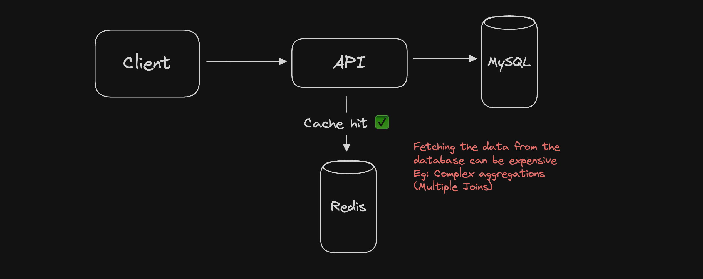

# What is Caching?

Caches are anything that helps you avoid **expensive** Network I/O, Disk I/O, or computation

1. API call to get profile information
2. Reading specific line from a file
3. Doing table joins

<aside>
💡 Store frequently accessed data in a temporary storage systems like Redis, MemCacheD
</aside>

---

### Caching is fast and expensive
---
- Hence we don’t cache all the data (Just a subset of data that is most likely to be accessed).
- `**Note: Caches are not restricted to RAM based storage**`
- Any storage, hat is ‘nearer’ nd helps you avoid something expensive is a cache for you
- SImply put, Caches are just glorified hash tables
