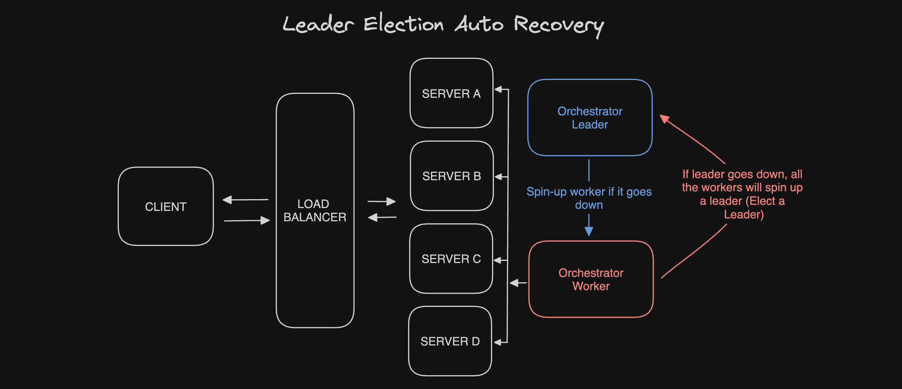

# Orchestrators

**Overview:**

Orchestrators play a pivotal role in server infrastructure management. They constantly monitor the status of servers, and in the event of a server failure, orchestrators initiate the process of provisioning a replacement server and seamlessly integrate it into the load balancing system.

**Leader Election:**

One of the critical functions of orchestrators is leader election. During this process, orchestrators determine which among them will assume the role of the leader orchestrator. If the current leader orchestrator encounters a failure, a worker orchestrator is elected to take over the leadership role.
