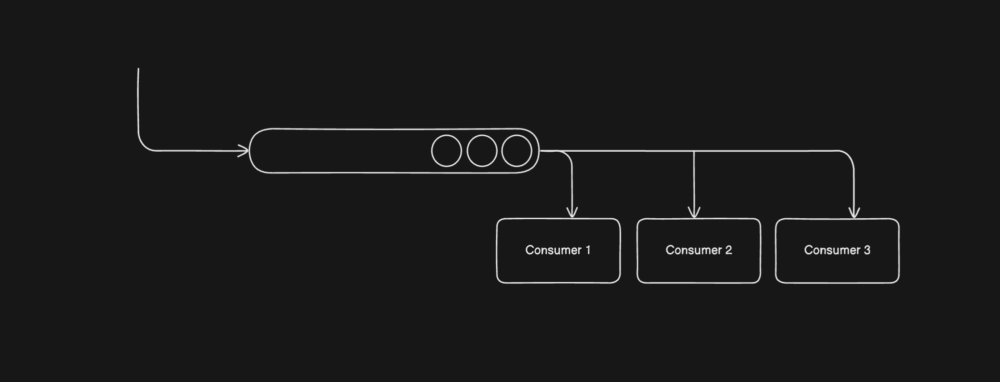
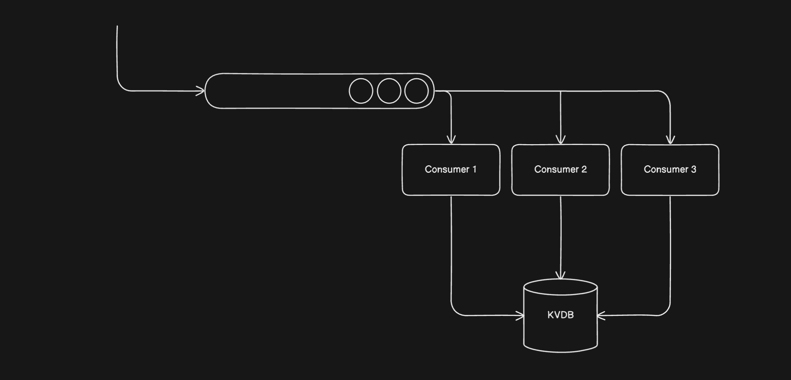

# Design Locks: Locks managed by a central machine

- **Brainstorm**
  - Locking
  - Core Properties

The 3 machines co-ordinate through a central lock manager

- Multiple Threads synchronise through
  - Mutex & Semaphore
  - Disk
  - Remote Lock

Example: ‘apt-get upgrade’ cannot be run twice concurrently

---

To understand remote locks better, let’s synchronise multiple consumers over an unprotected remote queue



Queue is unprotected, we want one consumer to make call to the queue at a time (Not all consumers can read at a time)

---

A consumer can pick the item from the queue, update the database in order to lock, so when consumer x finishes the processing it can release the lock by updating the database

- Database Requirements
  - A key-value store
  - TTL
  - Atomic Database

Redis would be the Database

- It is a KV Store
- It provides RedLock
- Also has a feature called TTL



### Consumer’s pseudocode

```sql
ACQ_LOCK()
READ_MSG()
REL_LOCK()
```

- All consumers wait on ACQ_LOCK()
- While one of them READ_MSG()

**Our requirements from the lock manager?**

1. Atomic Operations
2. Automatic Expiration

(As we discussed in database requirements)

### Function to acquire the lock

---

```tsx
function acquireLock(q: string) {
  // IP Address, host name or could be anything
  const consumerId = getMyId();
  while (true) {
    /**
     * setnx: set a key with some expiration time
     * It is an atomic command
     * If the key is already set, don't replace it
     */
    //
    const v = redis.setnx(q, consumer_id, 300);
    // The program returns and continues it's execution
    if (v === 1) return;
    // While others wait or stuck on this while loop (300ms)
    else continue;
  }
}
```

### Function to release the lock

---

```tsx
function releaseLock(q: string) {
  const consumerId = getMyId();
  const v = redis.get(q);
  // Delete if the consumer owns the locks, or else don't delete it
  if (v === consumerId) redis.delete(q);
}
```

‘EVAL’ Executed atomically using LUA Script (Kind of like a procedure)
