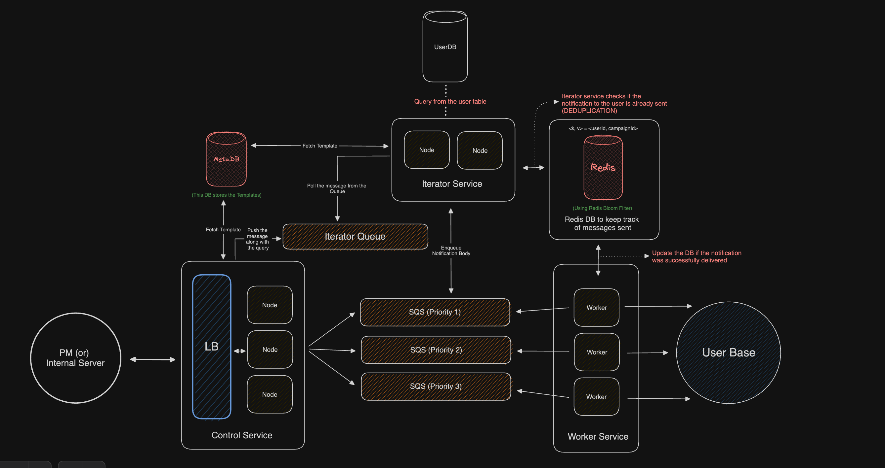

# Design a notification system

This design system basically handle all kinds of notifications, from reminders to mass campaign notification

- MetaDB to store the templates
- Redis (With Bloom Filter) to keep track of notifications (If they are sent to the user or not)
- SQS queues to ensure resiliency
- Load Balancer to evenly distribute the load and ensure availability

<!--- Eraser file: https://app.eraser.io/workspace/vpB2BC9UzFnNrhbPQ0WT --->